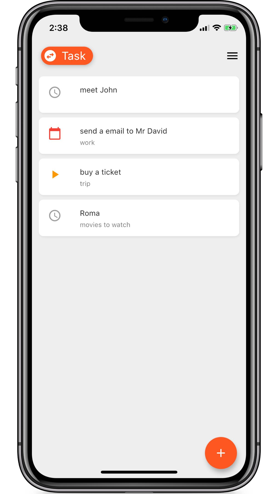
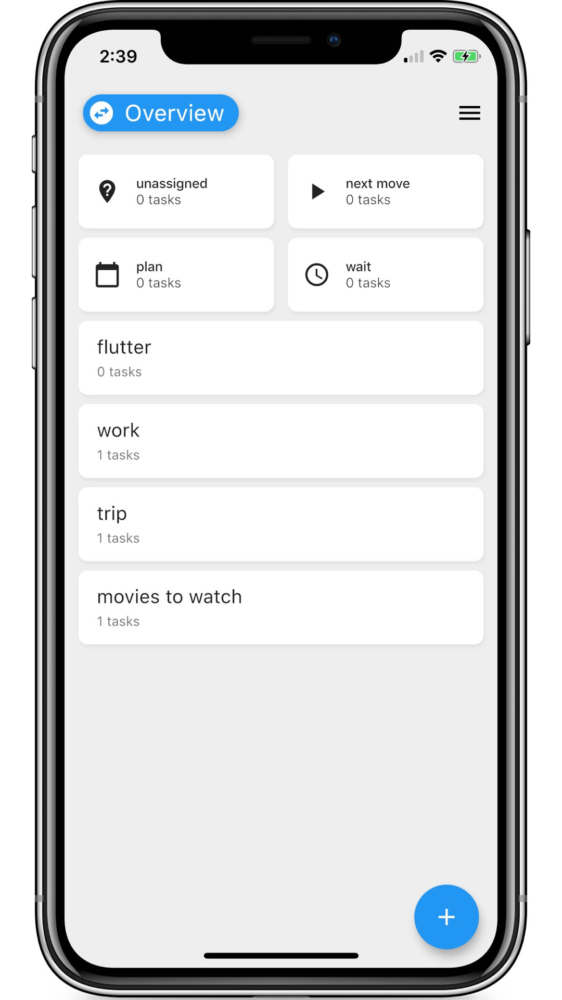
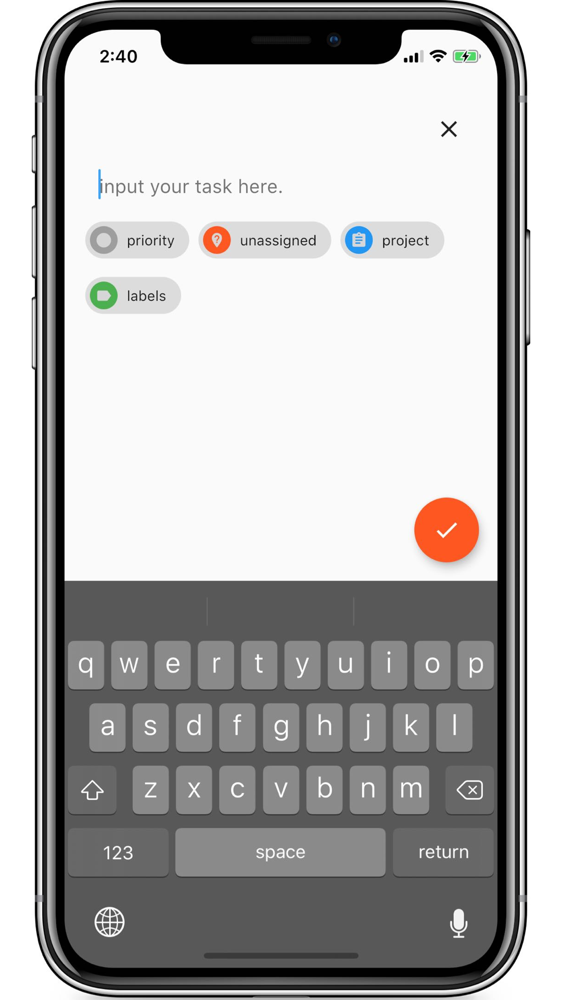
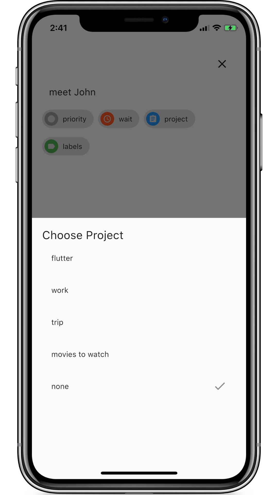

# forget

Forget is a time management app that can help to organize your tasks, and categorize tasks according to urgency and some other attributes, and set reminders for tasks.

Too many stuffs in your head? Write them down in Forget.
Only by clearing the brain can it run faster.
Assign all your tasks:
> Next Move - tasks that can be accomplished immediately or need to be ac­com­plished as soon as possible.
> Plan - Tasks that need to be done at a specific time.
> Waiting - not very urgent or undetermined.
Review your task list regularly to minimize the number of not assigned tasks.
If something is too complex, create a project to manage it. Multiple tasks can be added under the project.

